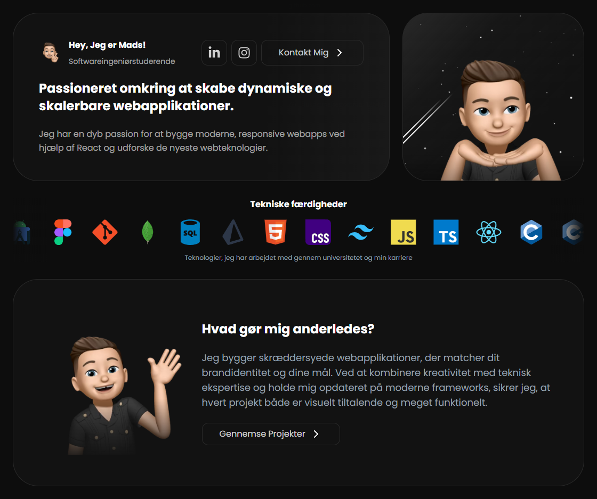

**<h1> &lt;Portfolio 2.0 /&gt; </h1>**

 
 

## 💡 Overview

Portfolio 2.0 is my modern, interactive personal portfolio website built with React and TypeScript, designed to showcase my skills, projects, and academic journey. With a focus on user experience and visual appeal, this portfolio features bilingual support, responsive design, and smooth animations powered by TailwindCSS and Framer Motion. The site offers visitors an engaging way to learn about my technical expertise, view my project work, and connect with me professionally.

## ✨ Features

- **Bilingual Support** - Automatic language detection for Danish and English experience.
- **Responsive Design** - Fully responsive layout adapting to all device sizes.
- **Tech Skills Showcase** - Continuous scrolling display of familiarized programming languages and technologies.
- **University Progress Tracker** - Detailed breakdown of completed courses and ECTS credits by semester.
- **Project Gallery** - Slideshow display of projects with automatic progression and pause control.
- **Email Contact Form** - Direct contact capability via EmailJS integration.
- **Real-Time Footer Clock** - Live display of local Aarhus, Denmark time.

## 👩‍💻 Tech Stack

- **React**: A JavaScript library for building user interfaces with component-based architecture.
- **Typescript**: A strongly typed programming language that builds on JavaScript for improved developer experience.
- **TailwindCSS**: A utility-first CSS framework for rapidly building custom designs without leaving your HTML.
- **Framer Motion**: A production-ready motion library for React that powers animations and gestures.
- **EmailJs**: A client-side JavaScript library for sending emails directly from your code without server dependencies.

## 📄 Release History

### 1.3

- Fixed meteors re-render on every scroll event, which reset their animations.

### 1.2

- Fixed Memojis being low quality on some devices by upscaling the images
- Updated the meteor effect with new styling, and fixed some spawning inside view

### 1.1

- Fixed completion percentage and university link overlapping on smaller screen sizes

### 1.0

- Release

## 🖊️ All Rights Reserved

© 2025 by Mads Dittmann Villadsen. All rights reserved.
